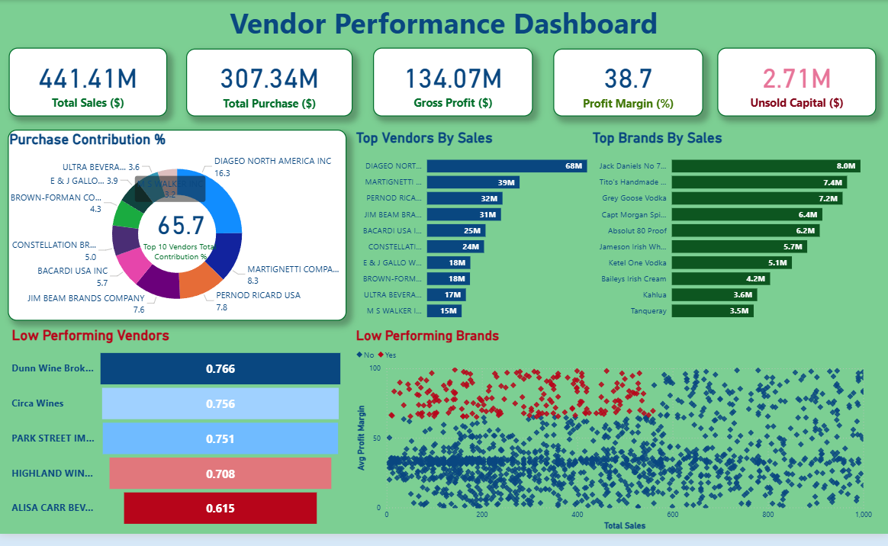

# 📊 Vendor Performance Analysis | Python • SQL • Power BI

## 🔍 Project Overview

This project presents an end-to-end vendor performance analysis designed to evaluate supplier contribution, profitability, and procurement efficiency using data-driven insights. The objective is to simulate a real-world business scenario where organizations must optimize vendor selection, purchasing strategies, and pricing decisions to improve overall profitability.

The workflow covers the complete analytics lifecycle, including data ingestion, cleaning, exploratory data analysis (EDA), KPI generation, and interactive dashboard development.

---

## 🎯 Business Objectives

* Evaluate vendor contribution to total sales and gross profit
* Identify high-performing and underperforming vendors
* Analyze purchasing patterns and cost efficiency
* Monitor profit margins across products and vendors
* Support data-driven procurement and pricing strategies

---

---

## 📊 Dashboard Preview



The interactive dashboard enables stakeholders to:

* Monitor vendor performance in real time
* Compare profitability across vendors
* Identify trends and growth opportunities
* Support strategic procurement decisions

---

## 🛠️ Tools & Technologies Used

* **Python** — Data cleaning, transformation, and analysis (Pandas, NumPy, Matplotlib, Seaborn)
* **SQL** — Data extraction, aggregation, and KPI generation
* **Power BI** — Interactive dashboard and business intelligence visualization
* **Excel / CSV** — Dataset storage and preprocessing
* **Jupyter Notebook** — Exploratory data analysis and modeling workflow

---

## 📂 Project Structure

```
Vendor-Performance-Analysis/
│
├── dashboard/   # Power BI dashboard file and visualization screenshots
├── data/        # Dataset used for analysis
├── notebook/    # Exploratory Data Analysis and analysis notebooks
├── scripts/     # Data ingestion and transformation scripts
├── report/      # Business insights and findings report
└── README.md
```

---

## 📈 Key Performance Indicators (KPIs)

The analysis focuses on business-critical metrics, including:

* Total Sales Revenue
* Gross Profit
* Profit Margin (%)
* Vendor Contribution to Revenue
* Top Vendors by Sales and Profit
* Purchase Cost vs Sales Performance
* Inventory Trends and Vendor Efficiency


## 🔄 Project Workflow

1. **Data Ingestion**

   * Imported sales and vendor datasets
   * Structured data for analysis using Python scripts

2. **Data Cleaning & Preparation**

   * Handled missing values and inconsistencies
   * Standardized formats and calculated derived fields

3. **Exploratory Data Analysis**

   * Identified trends, correlations, and anomalies
   * Evaluated vendor sales distribution and profit patterns

4. **KPI Calculation**

   * Computed gross profit and profit margins
   * Aggregated vendor-level performance metrics using SQL and Python

5. **Dashboard Development**

   * Designed an interactive Power BI dashboard
   * Visualized KPIs for decision-making support

6. **Business Insights & Recommendations**

   * Identified top-performing vendors
   * Highlighted underperforming vendors requiring intervention
   * Suggested procurement optimization opportunities

---

## 💡 Key Insights

* A small percentage of vendors contributed disproportionately to total revenue and profit.
* Certain vendors showed high sales volume but low profit margins, indicating pricing inefficiencies.
* Bulk purchasing demonstrated cost advantages but required inventory optimization to avoid holding costs.
* Vendor performance varied significantly across product categories, suggesting opportunities for strategic vendor allocation.

---

## 🚀 Business Impact

The insights derived from this project can help organizations:

* Improve vendor selection strategies
* Optimize procurement costs
* Increase profitability through data-driven decisions
* Identify growth and efficiency opportunities
* Enhance supply chain performance

---

## 📄 Report

A detailed business report with insights and recommendations is available in the `report/` folder.

---

## 👨‍💻 Author

**Ashish**

Aspiring Data Analyst skilled in Python, SQL, and Business Intelligence with a focus on solving real-world business problems using data-driven insights.

---

## ⭐ Why This Project Matters

This project demonstrates:

✔ End-to-end analytics capability
✔ Business problem-solving mindset
✔ Technical proficiency in Python, SQL, and Power BI
✔ Ability to convert raw data into actionable insights

---

## 📬 Contact

Feel free to connect for opportunities, collaboration, or feedback.
For queries or collaboration, feel free to connect via [LinkedIn](https://www.linkedin.com/in/ashish-sriramoju).

---


